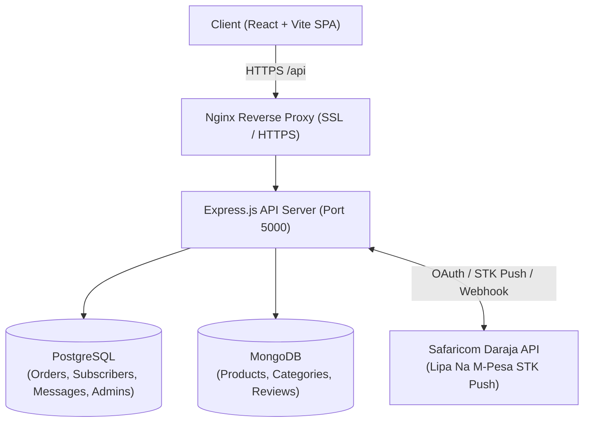

# Naoja Retail Shop — Electricals & Electronics E-Commerce Platform

[](https://nodejs.org/)
[](https://react.dev/)
[](https://vitejs.dev/)
[](https://tailwindcss.com/)
[](https://www.postgresql.org/)
[](https://developer.safaricom.co.ke/)

Naoja Retail Shop is a full-featured e-commerce platform built specifically for **Naoja Ventures**, an electrical and electronics retail business located in **Lurambi, Kakamega, Kenya**. 

The system features real-time product browsing across 14 specialized categories, a cart and checkout workflow with automated **Safaricom Lipa Na M-Pesa STK Push (Till 4149288)**, physical store pickup or local delivery management, live customer order tracking, and an authenticated administrative portal for inventory, order fulfillment, and reviews.

---

## Table of Contents

- [System Architecture](#system-architecture)
- [Project Directory Structure](#project-directory-structure)
- [Getting Started Locally](#getting-started-locally)
  - [Prerequisites](#prerequisites)
  - [Database Setup](#database-setup)
  - [Backend Setup](#backend-setup)
  - [Frontend Setup](#frontend-setup)
- [Environment Configuration](#environment-configuration)
- [Safaricom Daraja M-Pesa Integration](#safaricom-daraja-m-pesa-integration)
  - [Testing in Sandbox](#testing-in-sandbox)
  - [Switching to Live / Production](#switching-to-live--production)
- [Production Deployment Guide](#production-deployment-guide)
  - [Process Management (PM2)](#process-management-pm2)
  - [Nginx Reverse Proxy & HTTPS](#nginx-reverse-proxy--https)
- [Security Features](#security-features)

---

## System Architecture



1. **Frontend**: React 18 SPA styled with Tailwind CSS, utilizing Lucide Icons and a resilient local fallback cache for testing.
2. **Backend**: Node.js & Express REST API with security middleware (rate limiting, secure CORS, JWT authentication).
3. **Databases**:
   - **PostgreSQL**: Stores transactional financial records (`orders`, `subscribers`, `messages`, `admins`).
   - **MongoDB**: Stores dynamic catalog documents (`products`, `categories`, `reviews`).
4. **Payments**: Direct integration with Safaricom Daraja M-Pesa API for instant STK Push prompts and C2B transaction confirmation callbacks.

---

## Project Directory Structure

```
Naojaretailshop/
├── backend/
│   ├── src/
│   │   ├── config/          # Database pools (pgPool, Mongoose, initPg schema)
│   │   ├── middleware/      # JWT Authentication & Authorization
│   │   ├── migrations/      # PostgreSQL SQL schema migrations
│   │   ├── models/          # MongoDB Mongoose models (Product, Category, Review)
│   │   ├── routes/          # REST API endpoints (auth, mpesa, products, orders)
│   │   └── scripts/         # DB seed & sync utilities
│   ├── uploads/             # Product image uploads directory
│   ├── docker-compose.yml   # Local PostgreSQL & MongoDB services
│   ├── server.js            # Express application entrypoint
│   ├── package.json
│   └── .env.example
├── frontend/
│   ├── src/
│   │   ├── components/      # UI components (Header, Footer, ProductCard, etc.)
│   │   ├── lib/             # API client, Cart Context, Fulfillment rules
│   │   ├── pages/           # Views (Home, Product, Category, Cart, Checkout, Account, Admin)
│   │   ├── App.jsx          # Route declarations & Admin auth guards
│   │   └── main.jsx
│   ├── index.html
│   ├── vite.config.js
│   ├── tailwind.config.js
│   ├── package.json
│   └── .env.example
└── README.md
```

---

## Getting Started Locally

### Prerequisites

- **Node.js**: v18.0.0 or higher
- **npm**: v9.0.0 or higher
- **Docker & Docker Compose** (or local installations of PostgreSQL and MongoDB)

### Database Setup

Start local PostgreSQL and MongoDB instances using Docker:

```bash
cd backend
docker-compose up -d
```

This starts:
- PostgreSQL on `localhost:5432` (`postgres` / `postgres`, DB: `naoja_shop`)
- MongoDB on `localhost:27017`

### Backend Setup

1. Navigate to the backend directory and install dependencies:
   ```bash
   cd backend
   npm install
   ```
2. Copy the sample environment file and configure variables:
   ```bash
   cp .env.example .env
   ```
3. Seed default admin and sample inventory:
   ```bash
   node src/scripts/seed.js
   ```
4. Start the backend development server:
   ```bash
   npm run dev
   ```
   The backend will start at `http://localhost:5000`.

### Frontend Setup

1. Open a new terminal, navigate to the frontend directory, and install dependencies:
   ```bash
   cd frontend
   npm install
   ```
2. Copy the frontend environment file:
   ```bash
   cp .env.example .env
   ```
3. Start the Vite development server:
   ```bash
   npm run dev
   ```
   The frontend will be available at `http://localhost:5173`.

---

## Environment Configuration

### Backend (`backend/.env`)

| Variable | Description | Default / Example |
| :--- | :--- | :--- |
| `PORT` | API server listening port | `5000` |
| `NODE_ENV` | Environment (`development` or `production`) | `development` |
| `FRONTEND_URL` | Allowed origin for CORS | `http://localhost:5173` |
| `PG_HOST` | PostgreSQL hostname | `localhost` |
| `PG_PORT` | PostgreSQL port | `5432` |
| `PG_USER` | PostgreSQL username | `postgres` |
| `PG_PASSWORD` | PostgreSQL password | `postgres` |
| `PG_DATABASE` | PostgreSQL database name | `naoja_shop` |
| `MONGODB_URI` | MongoDB connection string | `mongodb://localhost:27017/naoja_shop` |
| `JWT_SECRET` | Secret key for admin session tokens | *(64-character random string)* |
| `MPESA_BASE_URL` | Safaricom API host | `https://api.safaricom.co.ke` |
| `MPESA_CONSUMER_KEY`| Daraja app Consumer Key | *(From Safaricom portal)* |
| `MPESA_CONSUMER_SECRET`| Daraja app Consumer Secret | *(From Safaricom portal)* |
| `MPESA_SHORTCODE` | Buy Goods Till or Paybill number | `4149288` |
| `MPESA_PASSKEY` | Lipa Na M-Pesa Online passkey | *(From Safaricom portal)* |
| `MPESA_CALLBACK_URL`| Public HTTPS webhook endpoint | `https://your-domain.com/api/mpesa/callback` |

### Frontend (`frontend/.env`)

| Variable | Description | Default / Example |
| :--- | :--- | :--- |
| `VITE_API_URL` | Backend URL for production builds | *(Leave blank if proxied via Nginx)* |

---

## Safaricom Daraja M-Pesa Integration

### How STK Push Works in Naoja Retail

1. **Order Creation**: When a customer confirms delivery details, the order is registered with status `pending`.
2. **STK Push Dispatch**: The backend requests an OAuth token from Safaricom and posts to `/mpesa/stkpush/v1/processrequest`.
3. **Checkout ID Binding**: The returned `CheckoutRequestID` is immediately saved to the order row in PostgreSQL.
4. **Instant Webhook Notification**: When the customer enters their PIN, Safaricom POSTs the receipt to `/api/mpesa/callback`. The backend matches the `CheckoutRequestID` and marks the order `paid` and `confirmed`.
5. **Real-time Client Polling**: The frontend checkout screen polls `/api/mpesa/order-status/:ref` every 3 seconds to transition automatically to the Order Confirmed view.

### Testing in Sandbox

For local development or testing with Safaricom sandbox numbers:
1. In `backend/.env`, set `MPESA_BASE_URL=https://sandbox.safaricom.co.ke`.
2. Use test credentials from [developer.safaricom.co.ke](https://developer.safaricom.co.ke/).
3. Expose your local port 5000 using **ngrok**:
   ```bash
   ngrok http 5000
   ```
4. Set `MPESA_CALLBACK_URL=https://your-ngrok-subdomain.ngrok-free.app/api/mpesa/callback`.

### Switching to Live / Production

1. Ensure KYC is completed for Till **4149288** on the Safaricom Daraja portal.
2. In the Daraja portal, go to **Go Live** and generate production Consumer Key, Consumer Secret, and Passkey.
3. In `backend/.env`:
   - Set `MPESA_BASE_URL=https://api.safaricom.co.ke`.
   - Update `MPESA_CONSUMER_KEY`, `MPESA_CONSUMER_SECRET`, and `MPESA_PASSKEY`.
   - Set `MPESA_CALLBACK_URL=https://<your-registered-domain>/api/mpesa/callback`.

---

## Production Deployment Guide

### Process Management (PM2)

Install PM2 globally on your production server:

```bash
npm install -g pm2
```

Start the backend service:

```bash
cd /var/www/naojaretailshop/backend
pm2 start server.js --name "naoja-backend"
pm2 save
pm2 startup
```

### Building the Frontend

Build the optimized production assets:

```bash
cd /var/www/naojaretailshop/frontend
npm run build
```
This generates the standalone production bundle in `frontend/dist/`.

### Nginx Reverse Proxy & HTTPS

Install Nginx and configure a server block (e.g., `/etc/nginx/sites-available/naoja`):

```nginx
server {
    listen 80;
    server_name naojaventures.com www.naojaventures.com;

    # Frontend Static SPA
    root /var/www/naojaretailshop/frontend/dist;
    index index.html;

    location / {
        try_files $uri $uri/ /index.html;
    }

    # Backend API Reverse Proxy
    location /api/ {
        proxy_pass http://localhost:5000/api/;
        proxy_http_version 1.1;
        proxy_set_header Upgrade $http_upgrade;
        proxy_set_header Connection 'upgrade';
        proxy_set_header Host $host;
        proxy_cache_bypass $http_upgrade;
        proxy_set_header X-Real-IP $remote_addr;
        proxy_set_header X-Forwarded-For $proxy_add_x_forwarded_for;
        proxy_set_header X-Forwarded-Proto $scheme;
    }

    # Uploaded Product Media
    location /uploads/ {
        proxy_pass http://localhost:5000/uploads/;
        proxy_set_header Host $host;
    }
}
```

Enable SSL using Let's Encrypt (required for Safaricom callbacks):

```bash
sudo certbot --nginx -d naojaventures.com -d www.naojaventures.com
```

---

## Security Features

- **Rate Limiting**: Protects `/api/auth/login` (brute-force defense) and `/api/mpesa/stkpush` (prevents toll fraud and spam).
- **CORS Protection**: Origin-checked middleware rejects unauthorized cross-origin requests in production.
- **SQL Parameterization**: All PostgreSQL queries use parameterized placeholders (`$1, $2`) to eliminate SQL injection.
- **JWT Protection**: Administrative routes (`/api/orders`, `/api/products`, `/api/analytics`) require signed bearer tokens.
- **Audit-ready Schema**: Database triggers track all `updated_at` timestamps automatically.
